<p align="center">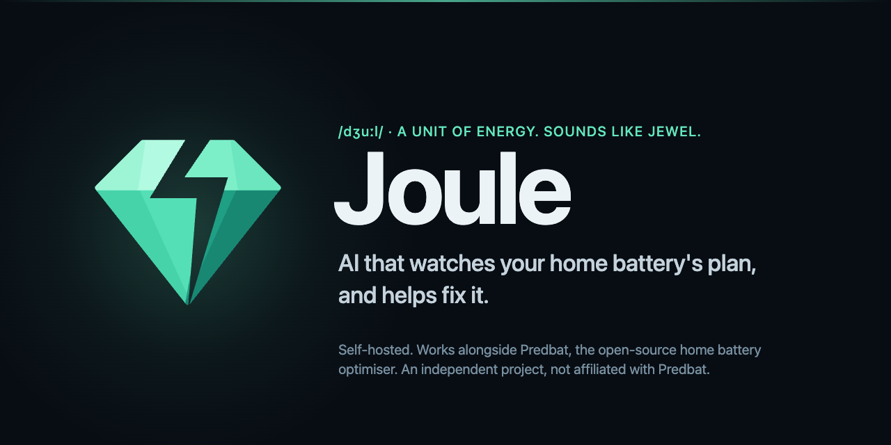</p>

<p align="center">
  <a href="https://github.com/MrDWilson/joule/actions/workflows/ci.yml"></a>
  <a href="https://github.com/MrDWilson/joule/releases"></a>
  <a href="LICENSE"></a>
</p>

# Joule

**Know what your home battery actually did, and why.**

Joule is a self-hosted dashboard and AI analyst for [Predbat](https://springfall2008.github.io/batpred/), the open-source home battery optimiser for Home Assistant. It keeps every plan Predbat makes, measures what really happened from your Home Assistant meters, and explains in plain English what went well, what went wrong and what to change. Nothing changes in Predbat unless you approve it.

> [!NOTE]
> Joule is an **independent project**. It works alongside Predbat but is not part of it, and is not affiliated with or endorsed by Predbat or its authors. Please report Joule problems here, not to the Predbat project. AI suggestions can be wrong; check them before you act.

<p align="center">
  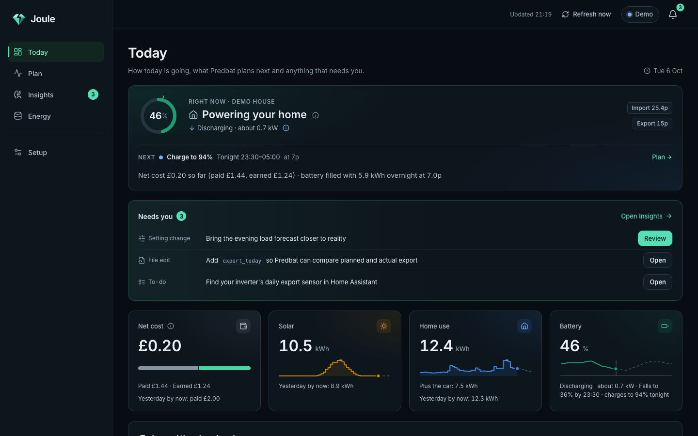
  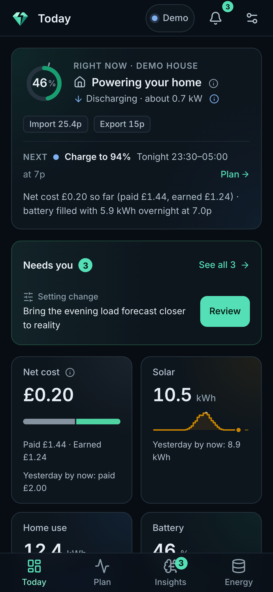
</p>

## What it does

- **Plan versus reality.** Every half-hour Predbat planned, next to what your meters measured: house load, solar, grid, battery and EV, with Predbat's own reasons in plain English.
- **Reviews in plain English.** Ask "why did the battery barely charge overnight?", or let it review on a schedule. It reads Predbat's plan, settings and logs plus your measured data, and says what happened and why, showing the evidence it looked at.
- **Changes you approve.** When the fix is a Predbat setting you get the exact value, with Predbat's own documentation cited, and a one-click undo. File edits (such as `apps.yaml`) come as a reviewable diff: copy it in yourself, or let Joule make it with a backup it puts back if Predbat objects.
- **Trials.** Each change is judged on equal before-and-after periods for forecast accuracy and measured cost, with warnings when the comparison is muddied by weather, tariffs or car charging.
- **It learns your house.** Tell it once that you have a heat pump or that the battery must never charge the car, and every review takes it into account. Disagree with a suggestion and it either accepts your reason or shows its evidence.
- **History.** Daily and weekly energy reports, a record of every setting change (including ones made outside Joule), and exact snapshots of your configuration files.
- **Works on your phone.** Every page is designed for a 390 px screen and can be added to your home screen.

## What it does not do

- **It does not replace Predbat or make its own battery plan.** Predbat still decides when to charge and discharge; Joule watches, explains and suggests.
- **It does not control your inverter, charger or Home Assistant.** The only thing it can change is Predbat's tunable settings, and only with `Predbat__WritesEnabled=true` plus your approval.
- **It does not edit your files.** Configuration file changes are shown as a diff for you to apply.
- **It does not phone home.** No telemetry, analytics or accounts. See [what leaves your network](#what-leaves-your-network).
- **It does not guess missing data.** A gap in your meters stays a gap, labelled as such, never a zero.

## Screenshots

All screenshots come from the built-in demo house (`node scripts/docs-screenshots.mjs`).

| Page | Desktop (1440 px) | Phone (390 px) |
| --- | --- | --- |
| **Today**: now, next, and anything that needs you |  |  |
| **Plan**: every half-hour, planned against measured | 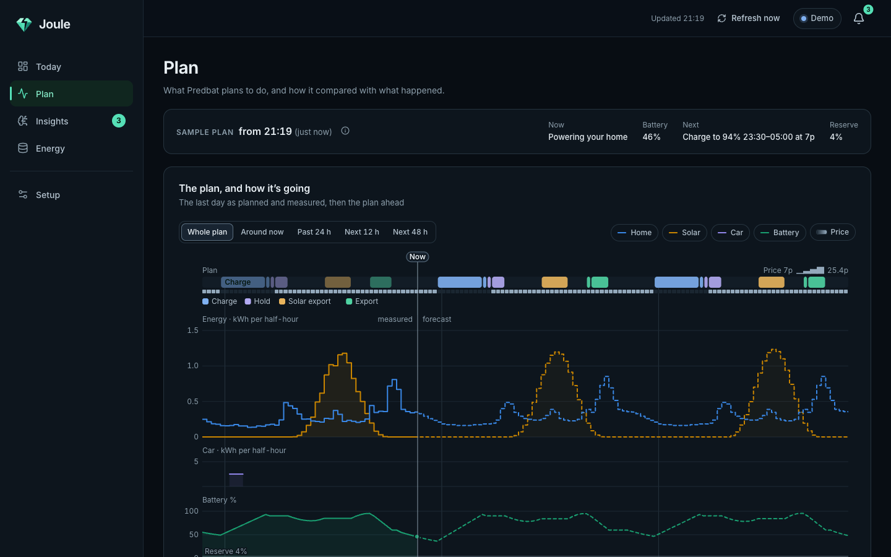 | 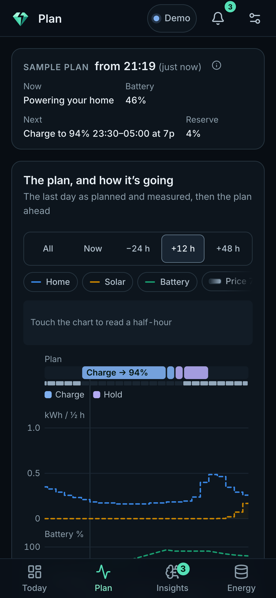 |
| **Insights**: AI reviews, suggestions and trials | 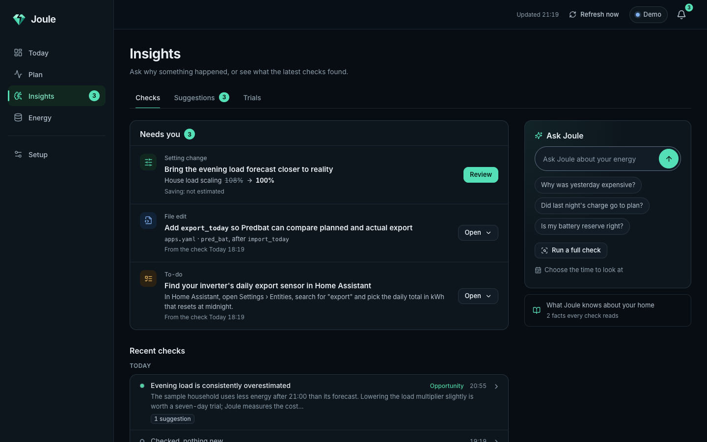 | 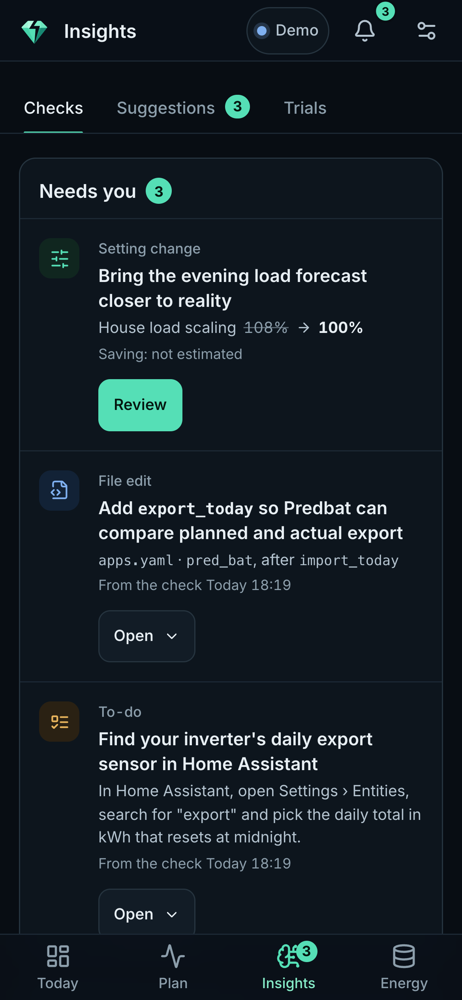 |
| **Energy**: measured days and weeks, with coverage | 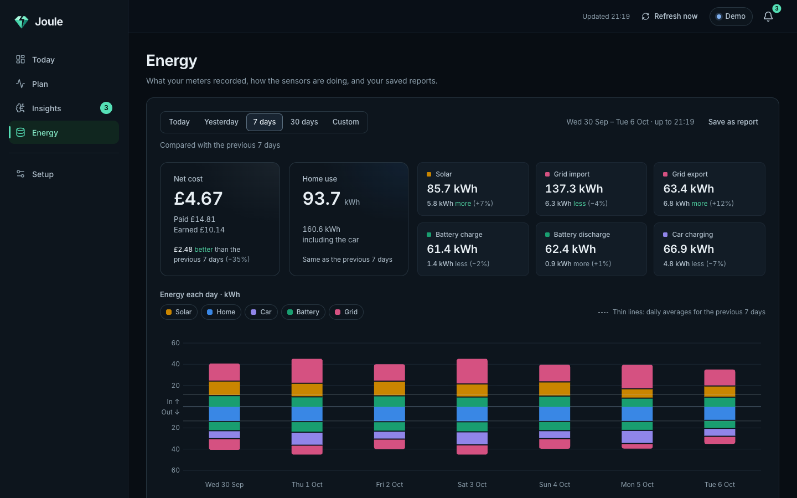 | 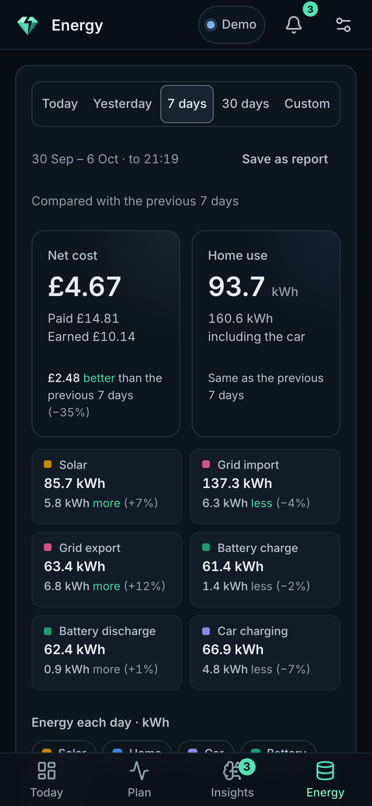 |
| **Setup**: connections, meters, AI and settings | 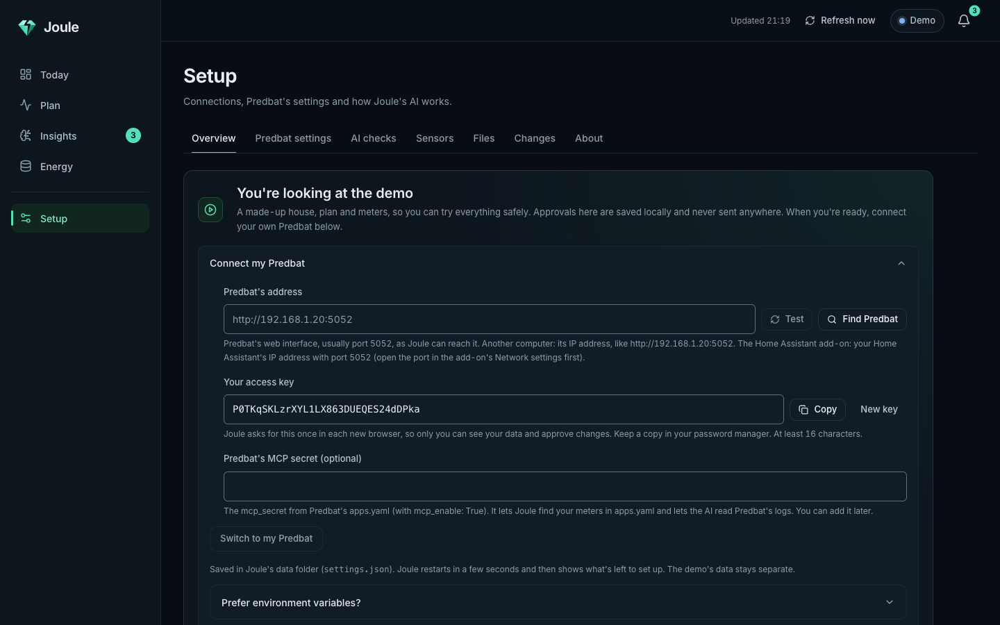 | 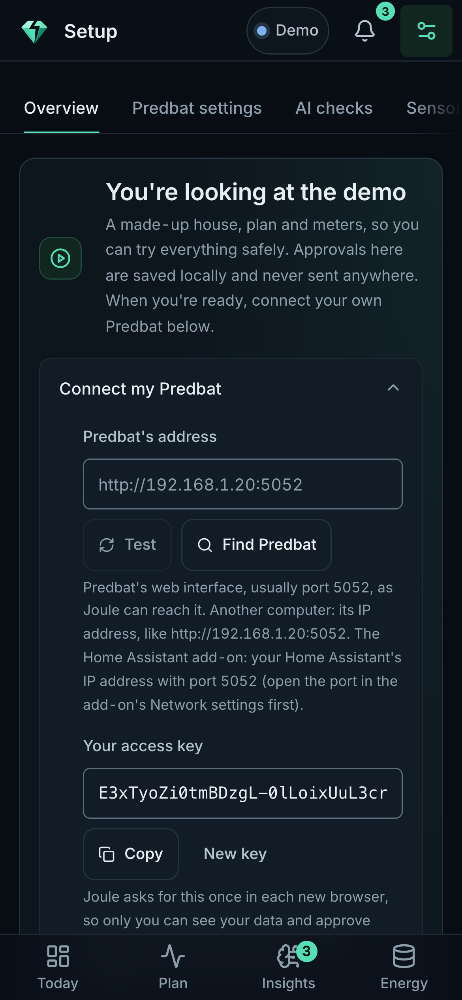 |

## How it works alongside Predbat

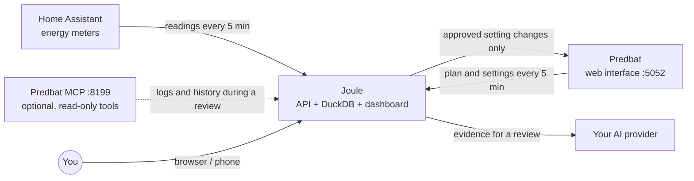

Joule runs as one container next to Predbat. It reads Predbat's web interface (the same one you open on port 5052) for the plan and settings, and your Home Assistant energy sensors for what really happened, either directly or through Predbat's copy of Home Assistant state. Everything is stored in a DuckDB database in Joule's own data volume. When you ask a question, or a scheduled review runs, Joule gives the AI a summary and lets it request the evidence it needs: plans, measurements, earlier reviews, your notes, Predbat's documentation and, if you enable Predbat's MCP server, Predbat's logs. Suggested changes are checked by the server, must cite Predbat's documentation, and wait for your approval.

## Quick start

You need Docker with Compose 2.24 or newer, and Predbat already running (as a Home Assistant add-on or in Docker).

**1. Start Joule.** Save this as `compose.yaml` in an empty folder (or download [`compose.yaml`](compose.yaml)):

```yaml
services:
  joule:
    image: ghcr.io/mrdwilson/joule:latest
    restart: unless-stopped
    ports:
      - "127.0.0.1:5080:5080"   # use "5080:5080" to open Joule from other computers
    extra_hosts:
      - "host.docker.internal:host-gateway"
    volumes:
      - joule-data:/data
volumes:
  joule-data:
```

```sh
docker compose up -d
```

**2. Open <http://localhost:5080>.** You'll see the demo: a made-up house, plan and AI, so you can explore every page before connecting anything. Nothing leaves your machine.

**3. Connect your Predbat.** Open **Setup** and fill in **Connect my Predbat**:

- **Predbat's address.** Press **Find Predbat** to try the usual places, or type it and press **Test**. Joule says in plain words what answered.
- **Your access key.** Joule makes one; copy it to your password manager. Each new browser asks for it once.
- **Predbat's MCP secret** (optional). Lets the AI read Predbat's logs and entity history. Joule finds your meters without it.

Press **Switch to my Predbat**. Joule saves your choices in its data volume, restarts in a few seconds and opens the checklist, still signed in.

**4. Follow the checklist.** Joule finds your Home Assistant energy meters from Predbat's own `apps.yaml` (`load_today`, `pv_today`, `import_today`, …) and the sensors Predbat sees, so there is nothing to map. The checklist shows what it found, with **Change** on each, and asks only where Predbat offers more than one sensor. Then choose an AI provider: sign in with your ChatGPT plan or paste an OpenAI-compatible API key. Optional steps add Predbat's logs (MCP), automatic checks, and letting Joule apply the changes you approve.

That's it: no `.env` to edit. Joule reads Predbat every five minutes and never changes anything in Predbat unless you allow changes **and** approve each one.

### Where is my Predbat?

Joule needs Predbat's web interface (normally port 5052) as Joule's container can reach it. Inside a container, `127.0.0.1` is the container itself, never your server.

| Your Predbat | Address to use |
| --- | --- |
| **Home Assistant add-on** | `http://<Home Assistant's IP>:5052`, for example `http://192.168.1.20:5052`. In Home Assistant, open the Predbat add-on, then **Configuration → Network**, and make sure port 5052 is set (8199 too for MCP). Run Joule with Docker on any machine on your network; it can't run as an add-on. |
| **Docker, same Compose project or network** | `http://predbat:5052` (its container name). Joule must share a Docker network with Predbat; see below. |
| **Docker on the same machine, different network** | `http://host.docker.internal:5052` (the compose file above maps that name). |
| **Another machine** | Its IP address, for example `http://192.168.1.20:5052`. |

### Alongside an existing Predbat compose

To join the Docker network your Predbat container is on, add Joule to that compose file (or reference the network as external):

```yaml
services:
  joule:
    image: ghcr.io/mrdwilson/joule:latest
    restart: unless-stopped
    ports:
      - "127.0.0.1:5080:5080"
    volumes:
      - joule-data:/data
    networks: [predbat]

volumes:
  joule-data:

networks:
  predbat:
    external: true   # the network your Predbat container is on
```

Then use `http://predbat:5052` in Setup.

### Prefer environment variables?

Every Setup choice has an environment variable, and environment variables always win (Setup shows them read-only). Copy [`.env.example`](.env.example) to `.env` next to `compose.yaml`, or add them under `environment:`, for example:

```sh
App__Demo=false
App__AccessKey=          # at least 16 characters: openssl rand -base64 24
Predbat__BaseUrl=http://predbat:5052
Predbat__McpToken=       # optional: Predbat's mcp_secret
```

Put an HTTPS reverse proxy in front before opening Joule beyond your home network. To build from source instead of pulling the image: `docker compose -f compose.yaml -f compose.build.yaml up -d --build`. For development, see [CONTRIBUTING.md](CONTRIBUTING.md).

## Configuration

Setup covers what most installs need and saves it in the data volume (`settings.json`). Everything can also be set with environment variables (in `.env` or under `environment:`), which always win. [`.env.example`](.env.example) has the common ones, [`.env.full.example`](.env.full.example) lists every option with its default, and [docs/configuration.md](docs/configuration.md) explains each one.

| Variable | Default | Purpose |
| --- | --- | --- |
| `App__Demo` | (demo until Setup switches) | `false` to always watch your real Predbat, `true` to pin the demo house. |
| `App__AuthMode` | `AccessKey` | `AccessKey`, or `None` only behind your own sign-in proxy. |
| `App__AccessKey` | (none) | The dashboard key, at least 16 characters. Required for live `AccessKey` mode; Setup makes one. |
| `App__SecureCookie` | `auto` | Set `true` behind an HTTPS proxy. |
| `App__FrameAncestors` | (nobody) | Sites allowed to frame Joule, for example your Home Assistant for a panel. |
| `Predbat__BaseUrl` | (none) | Predbat's web interface, usually port 5052. |
| `Predbat__WritesEnabled` | `false` | Allow approved setting changes to be written to Predbat. |
| `Predbat__McpToken` | (none) | Predbat's `mcp_secret`, so the AI can read logs and entity history. |
| `Ai__ApiKey`, `Ai__ApiBaseUrl` | (none), OpenAI | An OpenAI-compatible chat-completions API. |
| `HomeAssistant__Entities__*` | (found from Predbat) | Optional overrides for your energy meters: `Load`, `Pv`, `GridImport`, `GridExport`, `BatteryCharge`, `BatteryDischarge`, `Ev`, `Soc`, tariffs, `StandingCharge`. `none` leaves one unmapped. |
| `HomeAssistant__BaseUrl`, `HomeAssistant__AccessToken` | (none) | Optional: read Home Assistant directly instead of through Predbat. |
| `HomeAssistant__TimeZone` | `Europe/London` | Your household's timezone, for "today" and reports. |
| `ConfigFiles__Root`, `ConfigFiles__AllowedFiles__0` | (off) | Keep versioned snapshots of mounted Predbat files such as `apps.yaml`. |
| `ConfigFiles__AllowEdits` | `false` | Let Joule make the AI's `apps.yaml` edits you review, with a copy it can put back ([how](docs/configuration.md#letting-joule-make-appsyaml-edits)). |

If a setting is wrong, Joule stops at startup with one line saying what to fix and exit code 2. All data lives in the `/data` volume; [back it up](docs/configuration.md#data-and-backups) like any other database.

## AI providers and costs

| Provider | Needs | Cost |
| --- | --- | --- |
| **Demo** | Nothing | Free. Scripted answers, demo mode only. |
| **API** | `Ai__ApiKey` (OpenAI or any chat-completions-compatible endpoint) | Billed per token by your provider. |
| **ChatGPT plan** | A one-time sign-in with `./scripts/chatgpt-signin.sh` on your own computer | Uses your ChatGPT plan's allowance. |

A review is a conversation in which the model asks for evidence, so most tokens are input tokens, and cost depends mostly on the model you choose and how often reviews run. Joule records the exact input, cached-input and output tokens of every run in the AI usage card, and estimates a dollar cost from the per-million-token prices you enter in AI settings (the estimate is not an invoice). To keep costs predictable:

- Scheduled reviews are off until you turn them on, and the daily run limit (12 by default) caps scheduled reviews and the questions you ask alike.
- Watch the AI usage card for a few days before raising the schedule or switching to a larger model.
- There is no automatic fallback between providers: Joule never moves you onto paid API use by itself.

Your AI provider receives the plan, settings, measurements and logs a review needs; secrets are masked first. [AI providers](docs/ai-providers.md) covers ChatGPT sign-in for Docker installs, Predbat MCP and exactly what the AI sees.

## Security model

Treat access to Joule like access to Predbat itself: it can read your energy data and logs, and, if you allow it, change Predbat settings.

- **`AccessKey` (default).** The dashboard asks for `App__AccessKey`. A correct key sets an `HttpOnly`, `SameSite=Strict` cookie for `App__SessionDays` (30 by default); repeated wrong keys are slowed down. API clients can send `X-Access-Key`.
- **`None`.** No sign-in at all. Use it **only** behind your own sign-in proxy (oauth2-proxy, Authelia, Authentik, Cloudflare Access and so on) that covers every path, with nothing else able to reach port 5080.

> [!WARNING]
> **Never expose Joule with `App__AuthMode=None` to the internet or an untrusted network.** Anyone who can reach it could read your data and, with writes enabled, change Predbat settings. Joule logs a loud warning at startup when `None` mode listens on all interfaces.

- The example `compose.yaml` publishes port 5080 on `127.0.0.1` only. Until you go live, anyone who can open Joule can use Setup, so keep it that way until you have your access key. Put an HTTPS reverse proxy in front before using Joule from other devices, and set `App__SecureCookie=true` behind it.
- Every API request from another site is refused, requests that change something must carry Joule's own request header, and responses carry a strict Content-Security-Policy and `X-Frame-Options: DENY`.
- Writes to Predbat need `Predbat__WritesEnabled=true` **and** your approval (or an Auto-mode permission you granted for one low-risk setting). Joule checks the value before writing, reads it back afterwards, and blocks further changes if it cannot confirm the result.
- The AI cannot grant permissions or change the mode, and Predbat MCP write tools are never offered to it.

[docs/security.md](docs/security.md) has the details and proxy requirements. To report a vulnerability, see [SECURITY.md](SECURITY.md).

## What leaves your network

- **Your AI provider**, only when a review or a reply to the AI runs. It receives the plan, settings, measurements and logs that review needs. Demo mode uses a scripted AI and sends nothing.
- **GitHub** (`raw.githubusercontent.com`): Predbat's documentation, downloaded the first time the AI needs to cite it and then cached in Joule's data volume.
- **The image registry** (`ghcr.io`) when Docker pulls an update.

There is no telemetry or analytics. Otherwise Joule only talks to your Predbat and Home Assistant.

## Documentation

- [Configuration](docs/configuration.md): every setting, networking, file snapshots, health checks, backups.
- [Security](docs/security.md): sign-in, running behind a proxy, what Joule can change.
- [AI providers](docs/ai-providers.md): API keys, ChatGPT sign-in, costs and limits, Predbat MCP.
- [Measurements](docs/measurements.md): mapping Home Assistant meters, how gaps and resets are counted.
- [Changes and trials](docs/experiments.md): approval modes, undo, and how Joule judges a change.
- [Development](docs/development.md): running from source, tests, screenshots and releases.
- [Changelog](CHANGELOG.md): what changed in each release, and what to check before upgrading.

## Contributing

Bug reports, ideas and pull requests are welcome. Please read [CONTRIBUTING.md](CONTRIBUTING.md) and the [code of conduct](CODE_OF_CONDUCT.md) first, and report security problems privately as described in [SECURITY.md](SECURITY.md).

## Licence

[MIT](LICENSE). Predbat is a separate project with its own licence; Joule includes an index of Predbat's public documentation so the AI can cite it.
